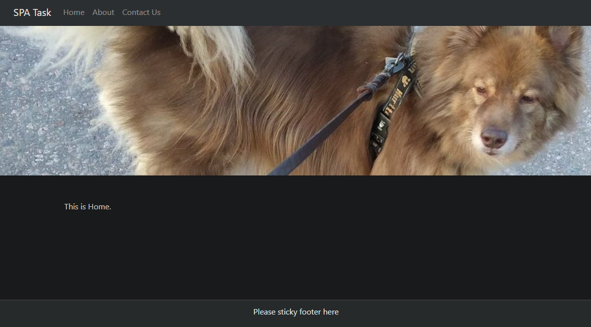

# Single Page Application task for Web-Dev course

Created with Bootstrap

Download the repo & run `npm install` to install all dependecies listed in package.json, then `npm start` in the root folder to launch the application. 

Open [http://localhost:3000](http://localhost:3000) to view it in your browser.

Picture of front page:

